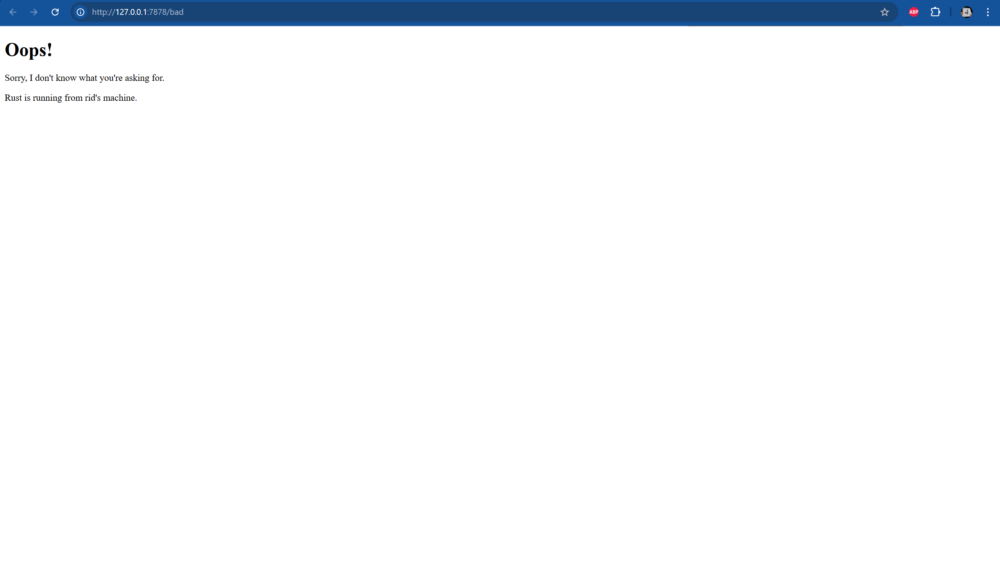

# Modul 6

## Commit 1 Reflection Notes

**Fungsi main:**
- **Pembuatan TCP Listener:**
  Program membuat TCP listener dengan memanggil `TcpListener::bind("127.0.0.1:7878")` yang mengikat listener ke alamat dan port tertentu.  
  Penggunaan `unwrap()` memastikan bahwa jika terjadi error (misalnya port sudah digunakan), program akan berhenti dengan panic.

- **Penanganan Koneksi Masuk:**  
  Listener menerima koneksi secara terus-menerus melalui iterator `listener.incoming()`.  
  Setiap koneksi yang diterima di-unwrapping untuk mendapatkan `TcpStream`, kemudian diproses oleh fungsi `handle_connection`.

**Fungsi handle_connection:**
- **Pembuatan BufReader:**  
  Fungsi ini membungkus `TcpStream` dengan `BufReader` untuk meningkatkan efisiensi pembacaan data dari koneksi melalui buffering.

- **Pembacaan dan Pengumpulan HTTP Request:**  
  Dengan method `lines()`, data dibaca baris per baris.  
  Setiap baris di-unwrapping dengan `map(|result| result.unwrap())` untuk mengonversi hasil pembacaan menjadi `String`.  
  Metode `take_while(|line| !line.is_empty())` digunakan untuk mengumpulkan baris sampai ditemukan baris kosong, yang menandai akhir dari header HTTP.  
  Semua baris yang dikumpulkan disimpan dalam `Vec<String>`.

- **Output Request:**  
  Data HTTP request yang terkumpul dicetak ke konsol dengan format yang rapi untuk tujuan debugging atau logging.

Secara keseluruhan, rangkaian kode ini menciptakan server TCP sederhana yang mampu menerima koneksi, membaca HTTP request yang dikirim oleh client, dan menampilkan isi request tersebut.

## Commit 2 Reflection Notes

Pada commit ini, fungsi `handle_connection` telah dikembangkan tidak hanya untuk membaca request melalui TCP stream saja, tetapi juga untuk mengirim response ke client. Setiap koneksi yang diterima akan selalu mendapatkan fixed response dengan status `200 OK`, tanpa mempertimbangkan konten request yang sebenarnya. Fungsi tersebut membaca file `hello.html` dan menghitung panjang kontennya untuk dimasukkan ke dalam header HTTP, sehingga response yang dikirim disusun dalam format `{status_line}\r\nContent-Length:{length}\r\n\r\n{contents}`. Di mana `{status_line}` adalah `200 OK`, `{length}` adalah panjang dari konten file, dan `{contents} `adalah isi file `hello.html`. Perlu dicatat bahwa saat ini setiap request selalu mengembalikan file `hello.html`, dan fitur ini akan diperbaiki pada commit selanjutnya untuk menyesuaikan respons berdasarkan request yang diterima.

## Commit 3 Reflection Notes

Pada commit 3, refaktorisasi fungsi `handle_connection` dilakukan dengan memisahkan logika penentuan status_line dan filename berdasarkan `GET` request yang diterima. Jika halaman yang diminta tidak ditemukan, server akan mengembalikan response berupa file `404.html`. Dengan memisahkan kode yang membaca file dan mengirim response dari logika if-else, duplikasi kode dapat dihindari, sehingga kode menjadi lebih modular, mudah dibaca, dan lebih mudah untuk di-maintain serta dikembangkan di masa depan.

## Commit 4 Reflection Notess

Fungsi `handle_connection` di-refactor dengan menggantikan blok if-else menjadi match statement untuk menangani beberapa endpoint, termasuk endpoint `/sleep`. Endpoint `/sleep  `secara khusus mengintroduksi delay selama 10 detik menggunakan `thread::sleep(Duration::from_secs(10))`, yang mensimulasikan kondisi halaman dengan respons yang lambat. Hal ini mengilustrasikan keterbatasan server single-threaded, di mana request yang membutuhkan waktu pemrosesan lama dapat menghambat request lainnya, sehingga pengguna harus menunggu antrian yang cukup lama jika mengakses halaman lain seperti `/`.

